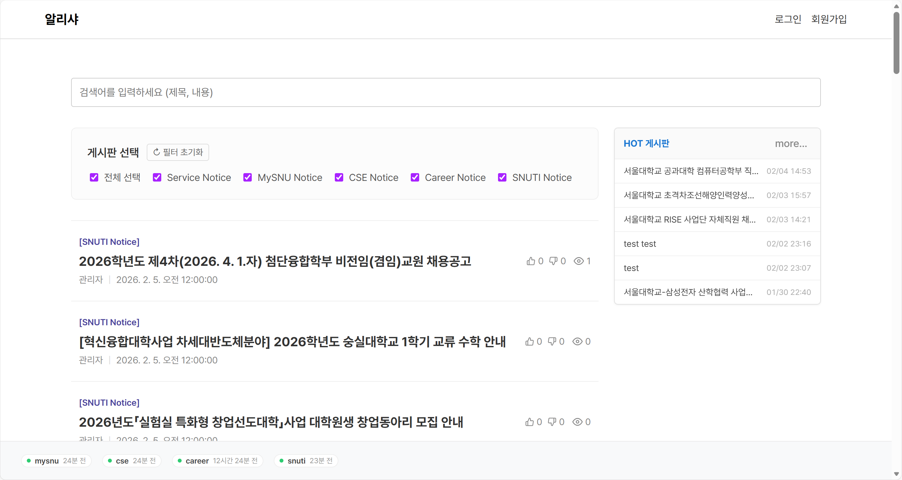
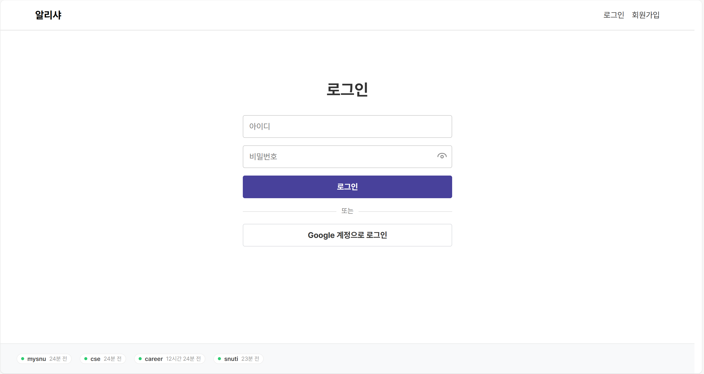
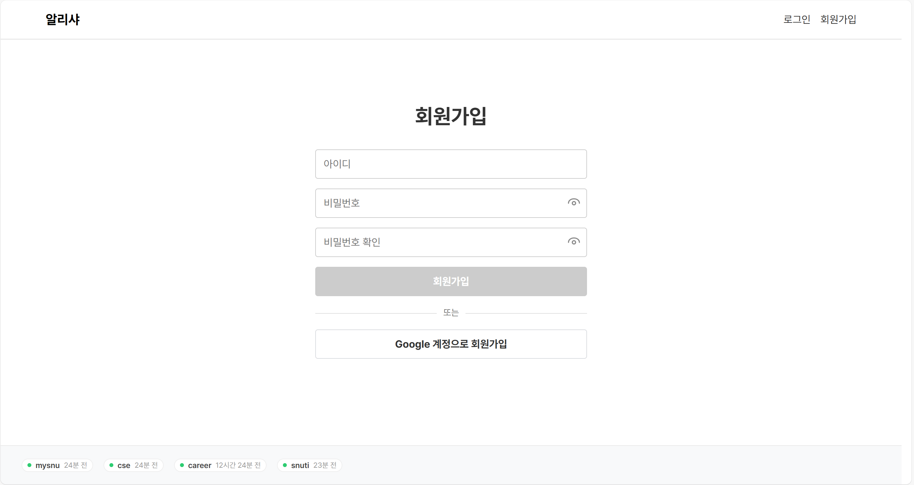
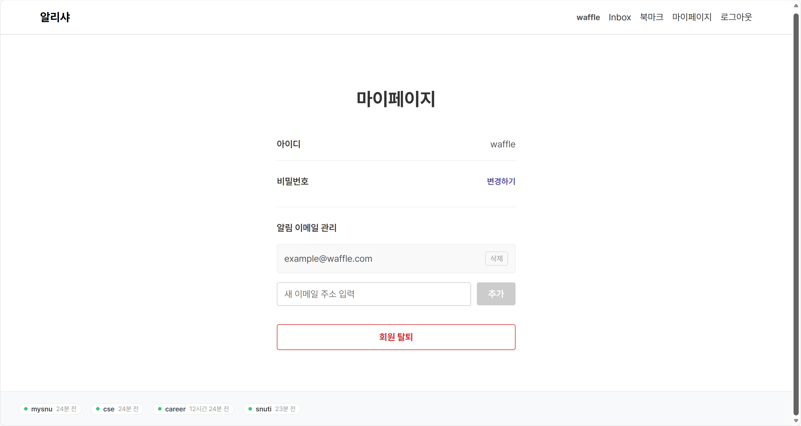
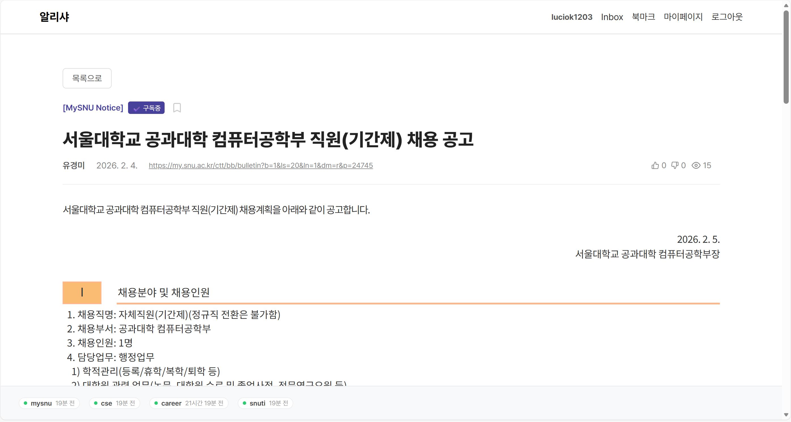
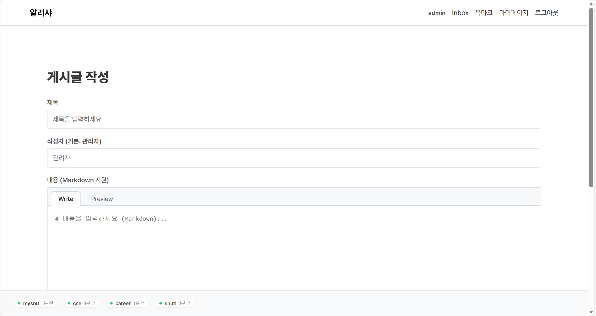
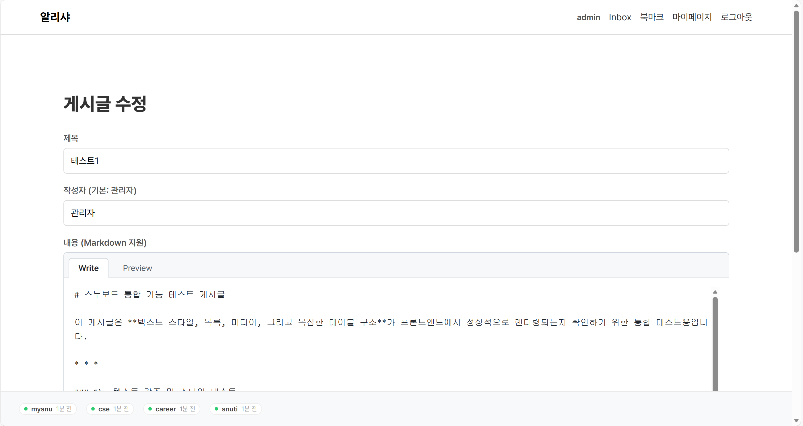
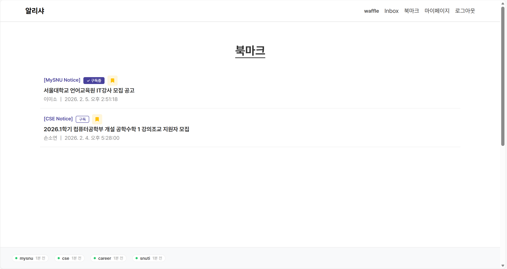
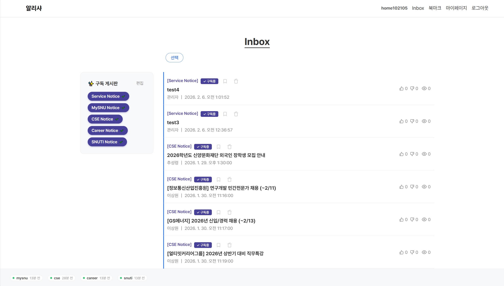

# 🔔 알리샤

## "서울대의 공지사항을 한곳에!"

> 마이스누, 학과 홈페이지, 기숙사 공지 등 이곳저곳에서 쏟아져 나오는  
> 공지를 전부 확인하는 것이 어렵고 번거롭다고 생각해보신 적 있나요?
>
> **알리샤**는 이런 문제를 해결하기 위해 만들어졌습니다.

## 📖 프로젝트 간단 설명

**알리샤**는 서울대학교 내 여러 플랫폼에 흩어져 있는 공지사항을  
하나의 대시보드에 모아 제공하는 **통합 공지 서비스**입니다.  

사용자가 여러 웹사이트를 일일이 방문하지 않아도  
검색어와 게시판 필터링으로 원하는 공지를 손쉽게 확인할 수 있도록 설계되었습니다.

---

## 📚 알리샤만의 특별한 기능

### 1. Inbox 및 이메일 알림
- **게시판 구독**: 사용자는 특정 게시판을 구독할 수 있으며, 해당 게시판에 새 게시글이 올라오면 사용자의 Inbox에 등록됩니다.
- **이메일 알림**: 이메일이 등록된 경우, 구독 중인 게시판의 업데이트 소식을 이메일로도 받아볼 수 있습니다.

### 2. 북마크
나중에 다시 확인해야 할 공지사항을 저장할 수 있는 기능입니다.

### 3. HOT 게시판
전체 공지 중 조회수가 높은 게시글들을 별도로 추출하여 메인 페이지 우측에 배치합니다.

### 4. 좋아요 및 싫어요
게시글에 좋아요 및 싫어요를 표시할 수 있습니다.

---

## 👥 팀원 소개

### 🛠️ Backend
| 이름 | 역할 |
|:---:|:---|
| **이한경** | **팀장** - 배포 및 CI/CD 설정 - 스웨거 설정 - 계정 관리, 로컬 및 구글 로그인 구현 - 이미지 업로드 구현 - 게시판 구독 및 Inbox 구현 - 북마크 구현 - 싫어요 기능 구현 - 첨단융합학부 크롤러 구현 - 관리자 권한 구현 |
| **송현우** | - 전체 데이터 table 설계 - 마이스누 크롤러 구현 - 크롤러 공통 기능 추상화 - 크롤러 상태 조회 기능 구현 - 경력개발센터, 컴퓨터공학부 크롤러 구현 - email CRD, email 발송 기능 구현 - 좋아요 기능 구현 |
| **이세환** | - 게시글 CRUD 구현 - 게시글 및 HOT 게시판 구현 - 게시글 검색 기능 구현 |

### 🎨 Frontend
| 이름 | 역할 |
|:---:|:---|
| **김동현** | - 메인 페이지, 로그인/회원가입 페이지, 마이페이지 구현 - 게시글 읽기, 생성, 수정, 삭제 기능 구현 - Header, Footer 구현 |
| **김한** | - 북마크 기능 및 페이지 구현 - Inbox 기능 및 페이지 구현 - HOT 게시판 구현 - 좋아요 및 싫어요 기능 구현 |

---

## 📸 프로젝트 뷰

### 1. 메인 페이지

### 2. 로그인/회원가입 페이지
 

### 3. 마이페이지

### 4. 게시글 상세 페이지

### 5. 게시글 생성/수정 페이지
 

### 6. 북마크 페이지

### 7. Inbox 페이지

---

  
  **알리샤**  
  *23-5 Team 2*
  

